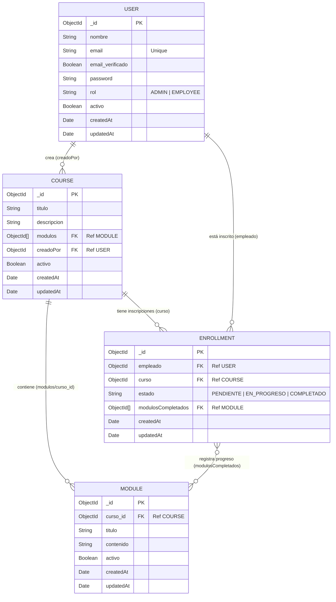

# Diagrama de la Base de Datos

El backend está construido con Node.js, Express y MongoDB (Mongoose). A continuación se muestra el diagrama Entidad-Relación de las colecciones de la base de datos, basado en los modelos encontrados en la carpeta `src/models`.

## Detalles de los Modelos

### 1. Modelo `User` (Usuario)
Representa a los usuarios del sistema. Administra la autenticación (contraseña encriptada, email, estado de verificación) y los permisos mediante roles.
- **Roles:** Pueden tener rol de `ADMIN` (Administrador) o `EMPLOYEE` (Empleado).

### 2. Modelo `Course` (Curso)
Define la estructura principal de un curso en la plataforma.
- Guarda una referencia al `User` que lo creó (típicamente un administrador).
- Contiene un array de referencias a los `Modules` (módulos) que lo componen para facilitar su consulta.

### 3. Modelo `Module` (Módulo)
Representa una unidad de contenido, material o lección específica dentro de un curso.
- Está ligado obligatoriamente a un `curso_id` (referencia al modelo `Course`).

### 4. Modelo `Enrollment` (Inscripción)
Es la tabla intermedia transaccional que vincula a un `User` (rol empleado) con un `Course`. Es fundamental para el seguimiento del aprendizaje.
- **Estado:** Lleva el seguimiento del estado general del curso (`PENDIENTE`, `EN_PROGRESO`, `COMPLETADO`).
- **Progreso:** Almacena un array de referencias (`modulosCompletados`) indicando exactamente qué módulos ya ha finalizado el empleado.
